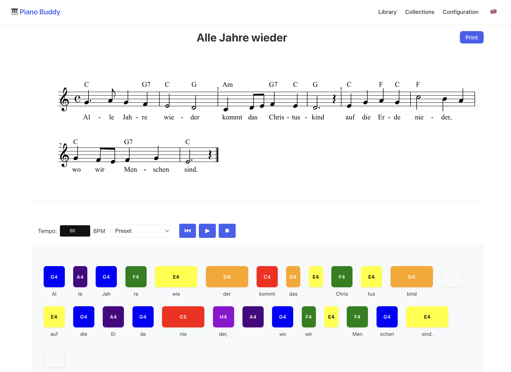

# Piano Buddy 🎹

A modern web application for learning piano through interactive music sheet visualization and playback. Built with Vue 3, TypeScript, and modern web technologies.



Use it online, for free, with no tracking or whatsoever: [🔗Piano Buddy](https://piano-buddy.netlify.app/)

## Features 🌟

- **Interactive Music Sheet Display**: Visualize sheet music using OpenSheetMusicDisplay
- **Colored Note Visualization**: Each note is color-coded for easier learning
- **Part Selection**: Support for multiple instrument parts in a single sheet
- **Music Library Management**: Upload and manage your own MusicXML files or use pre-configured songs
- **Offline Support**: Works without internet connection after initial load
- **Internationalization**: Supports multiple languages (English, German)
- **Responsive Design**: Works seamlessly on desktop and mobile devices
- **Zero Tracking**: Complete privacy, no analytics or tracking

## Technology Stack 💻

- **Frontend Framework**: Vue 3 with TypeScript
- **Router**: Vue Router
- **Database**: Dexie.js (IndexedDB wrapper)
- **Music Sheet Rendering**: OpenSheetMusicDisplay
- **Build Tool**: Vite
- **Package Manager**: npm
- **Testing**: 
  - Unit Tests: Vitest
  - E2E Tests: Playwright
- **Code Quality**:
  - ESLint
  - Prettier
  - TypeScript
  - Husky for Git hooks

## Getting Started 🚀

### Prerequisites

- Node.js (v18 or higher recommended)
- npm (v9 or higher)

### Installation

1. Clone the repository:

   ```bash
   git clone https://github.com/yourusername/piano-buddy.git
   cd piano-buddy
   ```

2. Install dependencies:

   ```bash
   npm install
   ```

3. Start the development server:

   ```bash
   npm run dev
   ```

4. Open your browser and navigate to `http://localhost:5173`

## Project Structure 📁

```
piano-buddy/
├── src/
│   ├── components/       # Vue components
│   │   ├── collections/ # Collection related components
│   │   ├── layout/      # Layout components
│   │   └── sheet/       # Music sheet components
│   ├── composables/     # Vue composables
│   ├── i18n/           # Internationalization
│   ├── services/       # Business logic services
│   ├── types/          # TypeScript type definitions
│   └── views/          # Page components
├── public/             # Static assets
└── tests/             # Test files
```

## Development 🛠

- `npm run dev` - Start development server
- `npm run build` - Build for production
- `npm run test` - Run unit tests
- `npm run test:e2e` - Run end-to-end tests
- `npm run lint` - Lint code
- `npm run format` - Format code

## Features in Detail 🎯

### Music Sheet Display

- Renders MusicXML files using OpenSheetMusicDisplay
- Supports multiple parts and voices
- Automatic page layout and scaling

### Note Visualization

- Color-coded notes for easier learning
- Dynamic width based on note duration
- Visual distinction between notes and rests
- Responsive layout with automatic line breaks

### Database Management

- Local storage using RxDB
- Automatic synchronization
- Offline-first architecture
- CRUD operations for music sheets

## Contributing 🤝

We welcome contributions! Please follow these steps:

1. Fork the repository
2. Create a feature branch (`git checkout -b feature/amazing-feature`)
3. Commit your changes (`git commit -m 'Add amazing feature'`)
4. Push to the branch (`git push origin feature/amazing-feature`)
5. Open a Pull Request

## License 📄

This project is licensed under the MIT License - see the [LICENSE](LICENSE) file for details.

## Acknowledgments 👏

- [OpenSheetMusicDisplay](https://opensheetmusicdisplay.org/) for music sheet rendering
- [RxDB](https://rxdb.info/) for local database management
- [Vue.js](https://vuejs.org/) for the reactive framework
- All contributors who have helped shape this project

## Support 💪

If you find this project useful, please consider giving it a star ⭭ on GitHub!
